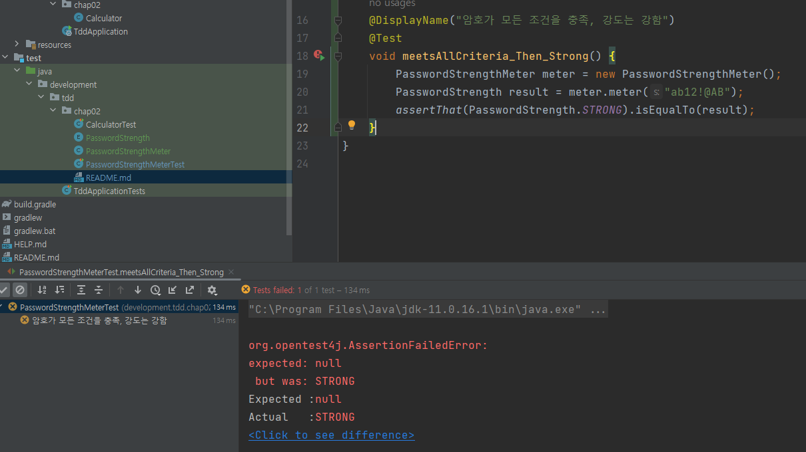

## 암호 검사기
검사할 규칙은 다음 세 가지이다.
- [ ] 길이가 8글자 이상
- [ ] 0부터 9 사이의 숫자를 포함
- [ ] 대문자 포함
  - 세 규칙을 모두 충족한다. -> 강함
  - 2개의 규칙을 충족한다. -> 보통
  - 1개 이하의 규칙을 충족한다. -> 약함
  
테스트할 기능의 이름을 정해보자. '약함', '보통', '강함'은 암호 등급이라고 생각할 수 있다.  
PasswordLevel이라는 단어를 사용하자.  
등급 대신에 강도라는 의미를 사용할 수도 있다.  
이 경우 PasswordStrength라는 단어를 사용할 수 있다.  
암호 등급과 암호 강도 중에서 PasswordStrength를 선택했다.  

```java
public class PasswordStrengthMeterTest {
    
    @DisplayName("테스트 메서드 생성")
    @Test
    void name() {
    }   
}
```
아무 검증도 하지 않는 테스트 메서드를 하나 만들었다.  
당연히 통과할 테스트지만, 테스트를 실행할 수 있는 환경을 갖추었는지 확인할 수 있으므로 나름대로 의미가 있다.

## 첫 번째 테스트: 모든 규칙을 충족하는 경우
`여기가 중요하다!` 첫 번째 테스트를 잘 선택하지 않으면 이후 진행 과정이 순탄하게 흘러가지 않는다.  
  
첫 번째 테스트를 선택할 때에는 가장 쉽거나 가장 예외적인 상황을 선택해야 한다.  
암호 검사 기능에서 가장 쉽거나 가장 예외적인 것은 무엇일까?  
- 모든 규칙을 충족하는 경우
- 모든 조건을 충족하지 않는 경우  
  
  
모든 조건을 충족하지 않는 테스트: 사실상 구현을 다 하고 테스트를 하는 방식과 다르지 않다.  
  
모든 규칙을 충족하는 경우: 테스트를 쉽게 통과시킬 수 있다.  
`강함`에 해당하는 값을 리턴하면 테스트에 통과할 수 있다.  
  
`모든 조건을 충족하는 경우를 먼저 테스트 코드로 작성해보자.`  
  
```java
@DisplayName("암호가 모든 조건을 충족, 강도는 강함")
    @Test
    void meetsAllCriteria_Then_Strong() {
        // 코드 작성해야 함
    }
```
테스트 코드를 작성할 차례. 테스트 코드는 다음과 같은 형태를 갖게 될 것이다.
```java
PasswordStrengthMeter meter = new PasswordStrengthMeter();
값타입 결과 = meter.meter("ab12!@AB");
assertThat(결과).isEqualTo(기댓값);
```
이 코드를 완성하려면 PasswordStrengthMeter#meter() 메서드의 리턴 타입을 결정해야한다.  
  
결과값은 암호의 강도이므로 int 타입을 사용할 수 있다.  
예를 들어 0이면 약함, 1이면 보통, 2이면 강함이라고 할 수 있다.  
  
또는 PasswordStrength.STRONG 형태의 열거 타입을 사용할 수도 있다.  
2와 같은 값보다는 PasswordStrength.STRONG과 같은 열거 타입 값이 암호 강도를 더 잘 표현하므로 이 예제에서 사용한다.  
  
## 첫 번째 테스트 코드 작성
```java
import org.junit.jupiter.api.DisplayName;
import org.junit.jupiter.api.Test;

import static org.assertj.core.api.Assertions.*;

public class PasswordStrengthMeterTest {

    @DisplayName("암호가 모든 조건을 충족, 강도는 강함")
    @Test
    void meetsAllCriteria_Then_Strong() {
        PasswordStrengthMeter meter = new PasswordStrengthMeter();
        PasswordStrength result = meter.meter("ab12!@AB");
        assertThat(PasswordStrength.STRONG).isEqualTo(result);
    }
}
```
PasswordStrengthMeter 타입과 PasswordStrength 타입이 존재하지 않으므로 컴파일 에러가 발생한다.  
  
먼저 할 일은 컴파일 에러를 없애는 것이다. 그래야 테스트를 실행할 수 있다.
PasswordStrength는 열거 타입으로 작성한다.  
  
### enum PasswordStrength: 열거 타입 작성
```java
public enum PasswordStrength {
    STRONG
}
```
STRONG 외에 WEAK나 NORMAL을 미리 추가할 수도 있지만, `TDD는 테스트를 통과시킬 만큼의 코드를 작성한다.`  
  
### PasswordStrengthMeter 클래스 작성
PasswordStrengthMeter 클래스를 작성해서 컴파일 에러를 마저 없앤다.
```java
public class PasswordStrengthMeter {
    public PasswordStrength meter(String s) {
        return null;
    }
}
```
컴파일 에러를 없앴으니 테스트를 실행할 수 있다. 실행 결과는 다음과 같다.  
기대한 값이 STRONG인데 실제 값은 null이어서 테스트에 실패했음을 알 수 있다.  

이 테스트를 통과시키는 방법은 간단하다.  
PasswordStrengthMeter#meter 메서드가 STRONG을 리턴하도록 수정하면 된다.  
```java
public class PasswordStrengthMeter {
    public PasswordStrength meter(String s) {
        return PasswordStrength.STRONG;
    }
}
```
meetsAllCriteria_Then_Strong() 테스트 메서드에 모든 규칙을 충족하는 예를 하나 더 추가하자.  
```java
@DisplayName("암호가 모든 조건을 충족, 강도는 강함")
    @Test
    void meetsAllCriteria_Then_Strong() {
        PasswordStrengthMeter meter = new PasswordStrengthMeter();
        PasswordStrength result = meter.meter("ab12!@AB");
        assertThat(PasswordStrength.STRONG).isEqualTo(result);
        PasswordStrength result2 = meter.meter("abc1!Add");
        assertThat(PasswordStrength.STRONG).isEqualTo(result2);
    }
```
코드를 추가했으니 다시 테스트를 실행한다. 테스트에 통과할 것이다.  
  
## 두 번째 테스트: 길이만 8글자 미만이고 나머지 조건은 충족하는 경우
두 번째 테스트 메서드를 추가하자.  
  
이번에 테스트할 대상은 패스워드 문자열의 길이가 8글자 미만이고 나머지 조건을 충족하는 암호이다.  
  
이 암호의 강도는 보통이어야 한다.  
  
### 두 번째 테스트 코드 작성
```java
@DisplayName("길이 8글자 미만, 나머지 조건 충족, 강도는 보통")
    @Test
    void meetsOtherCriteria_except_for_Length_Then_Normal() {
        PasswordStrengthMeter meter = new PasswordStrengthMeter();
        PasswordStrength result = meter.meter("ab12!@A");
        assertThat(PasswordStrength.NORMAL).isEqualTo(result);
    }   
```
PasswordStrength 열거 타입에 NORMAL이 없으므로 컴파일 에러가 발생한다.  
NORMAL을 추가해서 컴파일 에러를 없앤다.  
  


