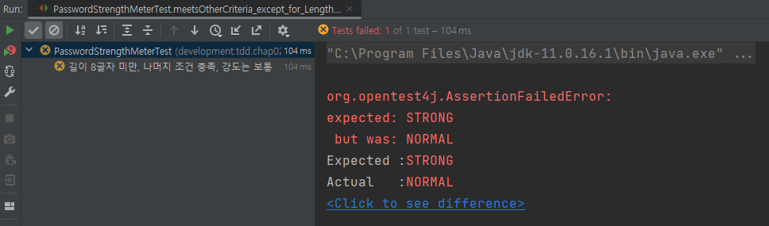

## 암호 검사기
검사할 규칙은 다음 세 가지이다.
- [ ] 길이가 8글자 이상
- [ ] 0부터 9 사이의 숫자를 포함
- [ ] 대문자 포함
  - 세 규칙을 모두 충족한다. -> 강함
  - 2개의 규칙을 충족한다. -> 보통
  - 1개 이하의 규칙을 충족한다. -> 약함
  
테스트할 기능의 이름을 정해보자. '약함', '보통', '강함'은 암호 등급이라고 생각할 수 있다.  
PasswordLevel이라는 단어를 사용하자.  
등급 대신에 강도라는 의미를 사용할 수도 있다.  
이 경우 PasswordStrength라는 단어를 사용할 수 있다.  
암호 등급과 암호 강도 중에서 PasswordStrength를 선택했다.  

```java
public class PasswordStrengthMeterTest {
    
    @DisplayName("테스트 메서드 생성")
    @Test
    void name() {
    }   
}
```
아무 검증도 하지 않는 테스트 메서드를 하나 만들었다.  
당연히 통과할 테스트지만, 테스트를 실행할 수 있는 환경을 갖추었는지 확인할 수 있으므로 나름대로 의미가 있다.

## 첫 번째 테스트: 모든 규칙을 충족하는 경우
`여기가 중요하다!` 첫 번째 테스트를 잘 선택하지 않으면 이후 진행 과정이 순탄하게 흘러가지 않는다.  
  
첫 번째 테스트를 선택할 때에는 가장 쉽거나 가장 예외적인 상황을 선택해야 한다.  
암호 검사 기능에서 가장 쉽거나 가장 예외적인 것은 무엇일까?  
- 모든 규칙을 충족하는 경우
- 모든 조건을 충족하지 않는 경우  
  
  
모든 조건을 충족하지 않는 테스트: 사실상 구현을 다 하고 테스트를 하는 방식과 다르지 않다.  
  
모든 규칙을 충족하는 경우: 테스트를 쉽게 통과시킬 수 있다.  
`강함`에 해당하는 값을 리턴하면 테스트에 통과할 수 있다.  
  
`모든 조건을 충족하는 경우를 먼저 테스트 코드로 작성해보자.`  
  
```java
@DisplayName("암호가 모든 조건을 충족, 강도는 강함")
    @Test
    void meetsAllCriteria_Then_Strong() {
        // 코드 작성해야 함
    }
```
테스트 코드를 작성할 차례. 테스트 코드는 다음과 같은 형태를 갖게 될 것이다.
```java
PasswordStrengthMeter meter = new PasswordStrengthMeter();
값타입 결과 = meter.meter("ab12!@AB");
assertThat(결과).isEqualTo(기댓값);
```
이 코드를 완성하려면 PasswordStrengthMeter#meter() 메서드의 리턴 타입을 결정해야한다.  
  
결과값은 암호의 강도이므로 int 타입을 사용할 수 있다.  
예를 들어 0이면 약함, 1이면 보통, 2이면 강함이라고 할 수 있다.  
  
또는 PasswordStrength.STRONG 형태의 열거 타입을 사용할 수도 있다.  
2와 같은 값보다는 PasswordStrength.STRONG과 같은 열거 타입 값이 암호 강도를 더 잘 표현하므로 이 예제에서 사용한다.  
  
## 첫 번째 테스트 코드 작성
```java
import org.junit.jupiter.api.DisplayName;
import org.junit.jupiter.api.Test;

import static org.assertj.core.api.Assertions.*;

public class PasswordStrengthMeterTest {

    @DisplayName("암호가 모든 조건을 충족, 강도는 강함")
    @Test
    void meetsAllCriteria_Then_Strong() {
        PasswordStrengthMeter meter = new PasswordStrengthMeter();
        PasswordStrength result = meter.meter("ab12!@AB");
        assertThat(PasswordStrength.STRONG).isEqualTo(result);
    }
}
```
PasswordStrengthMeter 타입과 PasswordStrength 타입이 존재하지 않으므로 컴파일 에러가 발생한다.  
  
먼저 할 일은 컴파일 에러를 없애는 것이다. 그래야 테스트를 실행할 수 있다.
PasswordStrength는 열거 타입으로 작성한다.  
  
### enum PasswordStrength: 열거 타입 작성
```java
public enum PasswordStrength {
    STRONG
}
```
STRONG 외에 WEAK나 NORMAL을 미리 추가할 수도 있지만, `TDD는 테스트를 통과시킬 만큼의 코드를 작성한다.`  
  
### PasswordStrengthMeter 클래스 작성
PasswordStrengthMeter 클래스를 작성해서 컴파일 에러를 마저 없앤다.
```java
public class PasswordStrengthMeter {
    public PasswordStrength meter(String s) {
        return null;
    }
}
```
컴파일 에러를 없앴으니 테스트를 실행할 수 있다. 실행 결과는 다음과 같다.  
기대한 값이 STRONG인데 실제 값은 null이어서 테스트에 실패했음을 알 수 있다.  

이 테스트를 통과시키는 방법은 간단하다.  
PasswordStrengthMeter#meter 메서드가 STRONG을 리턴하도록 수정하면 된다.  
```java
public class PasswordStrengthMeter {
    public PasswordStrength meter(String s) {
        return PasswordStrength.STRONG;
    }
}
```
meetsAllCriteria_Then_Strong() 테스트 메서드에 모든 규칙을 충족하는 예를 하나 더 추가하자.  
```java
@DisplayName("암호가 모든 조건을 충족, 강도는 강함")
    @Test
    void meetsAllCriteria_Then_Strong() {
        PasswordStrengthMeter meter = new PasswordStrengthMeter();
        PasswordStrength result = meter.meter("ab12!@AB");
        assertThat(PasswordStrength.STRONG).isEqualTo(result);
        PasswordStrength result2 = meter.meter("abc1!Add");
        assertThat(PasswordStrength.STRONG).isEqualTo(result2);
    }
```
코드를 추가했으니 다시 테스트를 실행한다. 테스트에 통과할 것이다.  
  
## 두 번째 테스트: 길이만 8글자 미만이고 나머지 조건은 충족하는 경우
두 번째 테스트 메서드를 추가하자.  
  
이번에 테스트할 대상은 패스워드 문자열의 길이가 8글자 미만이고 나머지 조건을 충족하는 암호이다.  
  
이 암호의 강도는 보통이어야 한다.  
  
### 두 번째 테스트 코드 작성
```java
@DisplayName("길이 8글자 미만, 나머지 조건 충족, 강도는 보통")
    @Test
    void meetsOtherCriteria_except_for_Length_Then_Normal() {
        PasswordStrengthMeter meter = new PasswordStrengthMeter();
        PasswordStrength result = meter.meter("ab12!@A");
        assertThat(PasswordStrength.NORMAL).isEqualTo(result);
    }   
```
### enum PasswordStrength: 열거 타입 작성  
PasswordStrength 열거 타입에 NORMAL이 없으므로 컴파일 에러가 발생한다.  
NORMAL을 추가해서 컴파일 에러를 없앤다.
```java
public enum PasswordStrength {
    NORMAL, STRONG
}
```
### PasswordStrengthMeterTest 실행
컴파일 에러를 없앤 뒤 PasswordStrengthMeterTest를 실행한다.  
  
새로 추가한 테스트가 실패했다.  
새로 추가한 테스트를 통과시키는 가장 쉬운 방법은 meter() 메서드가 NORMAL을 리턴하도록 수정하는 것이다.  
### meter() 메서드 수정
```java
public class PasswordStrengthMeter {
    public PasswordStrength meter(String s) {
        return PasswordStrength.NORMAL; // 두 번째 테스트만 통과하게 됨
    }
}
```

그런데 이렇게 수정하면 앞서 만든 테스트를 통과하지 못한다. (Strong)  
  
두 테스트를 모두 통과시킬 수 있는 만큼 코드를 작성해 보자.  
  
쉬운 방법은 길이가 8보다 작으면 NORMAL을 리턴하는 코드를 추가하는 것이다.
  
### 두 테스트를 통과시키기 위한 코드 추가
```java
public class PasswordStrengthMeter {
    public PasswordStrength meter(String s) {
        if (s.length() < 8) {
            return PasswordStrength.NORMAL;
        }
        return PasswordStrength.STRONG;
    }
}
```
코드를 수정했으니 테스트를 실행하자.
### 테스트 실행
  
통과다!  
  
앞서 예와 동일하게 길이가 8 미만이고 나머지 조건은 충족하는 암호에 대한 검증 코드를 추가하고 테스트를 실행해보자
### 검증 코드 추가
```java
@DisplayName("길이 8글자 미만, 나머지 조건 충족, 강도는 보통")
    @Test
    void meetsOtherCriteria_except_for_Length_Then_Normal() {
        PasswordStrengthMeter meter = new PasswordStrengthMeter();
        PasswordStrength result = meter.meter("ab12!@A");
        assertThat(PasswordStrength.NORMAL).isEqualTo(result);
        PasswordStrength result2 = meter.meter("Ab12!c");
        assertThat(PasswordStrength.NORMAL).isEqualTo(result2);
    }
```
  
통과!  

## 세 번째 테스트: 숫자를 포함하지 않고 나머지 조건을 충족하는 경우
세 번째 테스트 메서드를 추가하자.  
이번 테스트 대상은 숫자를 포함하지 않고 나머지 조건은 충족하는 암호이다.  
  
이 암호도 보통 강도를 가져야 한다.  
  
### 세 번째 테스트 코드 작성
```java
@DisplayName("숫자 포함x, 나머지 조건 충족, 강도는 보통")
@Test
void meetsOtherCriteria_except_for_number_Then_Normal() {
    PasswordStrengthMeter meter = new PasswordStrengthMeter();
    PasswordStrength result = meter.meter("ab!@ABqwer");
    assertThat(PasswordStrength.NORMAL).isEqualTo(result);
}
```
테스트를 실행하면 새로 추가한 테스트가 실패한 것을 알 수 있다.  
  
  
  
이 테스트를 통과하는 방법은 어렵지 않다.  
암호가 숫자를 포함했는지를 판단해서 포함하지 않은 경우 NORMAL을 리턴하게 구현하면 된다.  
  
### 테스트를 통과시키기 위한 코드 추가
```java
public class PasswordStrengthMeter {
    public PasswordStrength meter(String s) {
        if (s.length() < 8) {
            return PasswordStrength.NORMAL;
        }
        // 여기부터 새로 추가함
        boolean containsNum = false;
        for (char ch : s.toCharArray()) {
            if (ch >= '0' && ch <= '9') {
                containsNum = true;
                break;
            }
        }
        if (!containsNum) {
            return PasswordStrength.NORMAL;
        }
        //
        return PasswordStrength.STRONG;
    }
}
```
각 문자를 비교해서 0 ~ 9 사이의 값을 갖는 문자가 없으면 NORMAL을 리턴하도록 했다.  
  
똑같이 따라했으면 모든 테스트가 통과할 것이다.  
  
  
  
### 코드 리팩토링
코드를 조금 리팩토링하자.  
숫자 포함 여부를 확인하는 코드를 메서드로 추출해서 가독성을 개선하고 메서드 길이도 줄여보자.  
  
```java
public class PasswordStrengthMeter {
    public PasswordStrength meter(String s) {
        if (s.length() < 8) {
            return PasswordStrength.NORMAL;
        }
        
        boolean containsNum = meetsContainingNumberCriteria(s);
        
        if (!containsNum) {
            return PasswordStrength.NORMAL;
        }
        return PasswordStrength.STRONG;
    }

    private boolean meetsContainingNumberCriteria(String s) {
        for (char ch : s.toCharArray()) {
            if (ch >= '0' && ch <= '9') {
                return true;
            }
        }
        return false;
    }
}
```
테스트 통과!  

  
  
## 코드 정리: 테스트 코드 정리
세 개의 테스트 메서드를 추가했다. 다음과 같은 형태를 갖는다.
```java
@Test
void 메서드이름() {
    PasswordStrengthMeter meter = new PasswordStrengthMeter();
    PasswordStrength result = meter.meter(암호);
    assertThat(PasswordStrength.STRONG).isEqualTo(result);
}
```
테스트 코드도 코드이기 때문에 유지보수 대상이다.  
중복을 알맞게 제거하거나 의미가 잘 드러나게 코드를 수정할 필요가 있다.  
  
먼저 PasswordStrengthMeter 객체를 생성하는 코드의 중복을 없애보자.  
  
```java
private PasswordStrengthMeter meter = new PasswordStrengthMeter();

@DisplayName("암호가 모든 조건을 충족, 강도는 강함")
@Test
void meetsAllCriteria_Then_Strong() {
    PasswordStrength result = meter.meter("ab12!@AB");
    assertThat(PasswordStrength.STRONG).isEqualTo(result);
    PasswordStrength result2 = meter.meter("abc1!Add");
    assertThat(PasswordStrength.STRONG).isEqualTo(result2);
}
``` 

암호 강도 측정 기능을 실행하고 이를 확인하는 코드도 중복을 없애보자.   
  
```java
PasswordStrength result = meter.meter(암호);
assertThat(PasswordStrength.STRONG).isEqualTo(result);
```
이런 중복은 메서드를 이용해서 제거할 수 있다.  
  
```java
public class PasswordStrengthMeterTest {

    private PasswordStrengthMeter meter = new PasswordStrengthMeter();

    private void assertStrength(String password, PasswordStrength expStr) {
      PasswordStrength result = meter.meter(password);
      assertThat(expStr).isEqualTo(result);
    }
  
    @DisplayName("테스트 메서드 생성")
    @Test
    void name() {
    }
  
    @DisplayName("암호가 모든 조건을 충족, 강도는 강함")
    @Test
    void meetsAllCriteria_Then_Strong() {
      assertStrength("ab12!@AB", PasswordStrength.STRONG);
      assertStrength("abc1!Add", PasswordStrength.STRONG);
    }
}
```
> 테스트 코드의 중복을 무턱대고 제거하면 안 된다.
> 중복을 제거한 뒤에도 테스트 코드의 가독성이 떨어지지 않고 수정이 용이한 경우에만 중복을 제거한다.
> 중복 제거 후 관리가 어려워지면 되돌려야 한다.

## 네 번째 테스트: 값이 없는 경우
테스트 코드를 작성하는 과정에서 아주 종요한 테스트를 놓쳤다.  
  
바로 값이 없는 경우를 테스트하지 않은 것이다.  
  
meter() 메서드에 null을 전달하면 NullPointerException이 발생하게 된다.  
  
null을 입력할 경우 암호 강도 측정기는 어떻게 반응해야 할까?  
- IllegalArgumentException 발생한다.
- 유효하지 않은 암호를 의미하는 PasswordStrength.INVALID를 리턴한다.
  
두 번째 방법을 선택해보자.  
  
### 네 번째 테스트 코드 작성
입력이 null인 경우에 대한 테스트 추가
```java
@DisplayName("입력이 null인 경우")
@Test
void nullInput_Then_Invalid() {
    assertStrength(null, PasswordStrength.INVALID);
}
```

코드를 추가했다면 PasswordStrength.INVALID에서 컴파일 에러가 발생할 것이다.  
INVALID를 추가해서 컴파일 에러를 없앤다.  
```java
public enum PasswordStrength {
    INVALID, NORMAL, STRONG
}
```
테스트를 실행하면 당연히 실패할 것이다.  
  
  

### 테스트를 통과시키기 위한 코드 추가
```java
public class PasswordStrengthMeter {
    public PasswordStrength meter(String s) {
      // 새로 추가한 부분
      if (s == null) {
        return PasswordStrength.INVALID;
      }
      //
  
      if (s.length() < 8) {
        return PasswordStrength.NORMAL;
      }
  
      boolean containsNum = meetsContainingNumberCriteria(s);
  
      if (!containsNum) {
        return PasswordStrength.NORMAL;
      }
      return PasswordStrength.STRONG;
    }
    
    ...생략
}
```
구현을 추가했으니 테스트에 통과할 것이다.  
  
  
  
예외 상황이 null만 있는 것은 아니다.  
빈 문자열도 예외 상황이다. 빈 문자열에 대한 테스트도 추가한다.  
  
```java
@DisplayName("입력이 빈 문자열인 경우")
@Test
void emptyInput_Then_Invalid() {
    assertStrength("", PasswordStrength.INVALID);    
}
```
테스트에 실패할 것이다.  
실패 결과를 보면 기대한 값 INVALID, 실제 결과 NORMAL  
  
  
  
이 테스트를 통과시키기 위해 PasswordStrengthMeter 클래스의 코드를 수정한다.  
  
```java
public PasswordStrength meter(String s){

    if(s==null||s.isEmpty()){
        return PasswordStrength.INVALID;
    }
  
    ...생략
}
```

